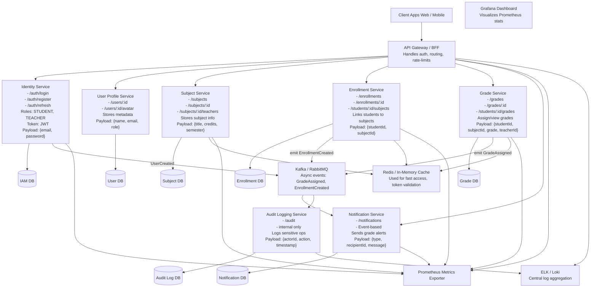

# Gradebook

### Scheme

```mermaid
graph TD

    %% Entry Layer
    Client[Client Apps Web / Mobile]
    Gateway["API Gateway / BFF
    Handles auth, routing, rate-limits"]

    %% Core Services
    IAM["Identity Service
    - /auth/login
    - /auth/register
    - /auth/refresh
    Roles: STUDENT, TEACHER
    Token: JWT
    Payload: {email, password}"]

    UserProfileService["User Profile Service
    - /users/:id
    - /users/:id/avatar
    Stores metadata
    Payload: {name, email, role}"]

    SubjectService["Subject Service
    - /subjects
    - /subjects/:id
    - /subjects/:id/teachers
    Stores subject info
    Payload: {title, credits, semester}"]

    EnrollmentService["Enrollment Service
    - /enrollments
    - /enrollments/:id
    - /students/:id/subjects
    Links students to subjects
    Payload: {studentId, subjectId}"]

    GradeService["Grade Service
    - /grades
    - /grades/:id
    - /students/:id/grades
    Assign/view grades
    Payload: {studentId, subjectId, grade, teacherId}"]

    NotificationService["Notification Service
    - /notifications
    - Event-based
    Sends grade alerts
    Payload: {type, recipientId, message}"]

    AuditService["Audit Logging Service
    - /audit
    - internal only
    Logs sensitive ops
    Payload: {actorId, action, timestamp}"]

    %% Databases
    IAMDB[(IAM DB)]
    UserProfileDB[(User DB)]
    SubjectDB[(Subject DB)]
    EnrollmentDB[(Enrollment DB)]
    GradeDB[(Grade DB)]
    NotificationDB[(Notification DB)]
    AuditDB[(Audit Log DB)]

    %% Infra
    EventBus["Kafka / RabbitMQ
    Async events: GradeAssigned, EnrollmentCreated"]

    RedisCache["Redis / In-Memory Cache
    Used for fast access, token validation"]

    Prometheus[Prometheus Metrics Exporter]
    Grafana["Grafana Dashboard
    Visualizes Prometheus stats"]
    ELKStack["ELK / Loki
    Central log aggregation"]

    %% Client routes through Gateway
    Client --> Gateway

    %% Gateway routes
    Gateway --> IAM
    Gateway --> UserProfileService
    Gateway --> SubjectService
    Gateway --> EnrollmentService
    Gateway --> GradeService
    Gateway --> NotificationService

    %% Services and DBs
    IAM --> IAMDB
    UserProfileService --> UserProfileDB
    SubjectService --> SubjectDB
    EnrollmentService --> EnrollmentDB
    GradeService --> GradeDB
    NotificationService --> NotificationDB
    AuditService --> AuditDB

    %% Event communication
    GradeService -- "emit GradeAssigned" --> EventBus
    EnrollmentService -- "emit EnrollmentCreated" --> EventBus
    IAM -- "UserCreated" --> EventBus
    EventBus --> NotificationService
    EventBus --> AuditService

    %% Caching
    GradeService --> RedisCache
    SubjectService --> RedisCache
    EnrollmentService --> RedisCache

    %% Observability
    IAM --> Prometheus
    SubjectService --> Prometheus
    GradeService --> Prometheus
    EnrollmentService --> Prometheus
    NotificationService --> Prometheus
    Gateway --> Prometheus
    Gateway --> ELKStack
    AuditService --> ELKStack
```