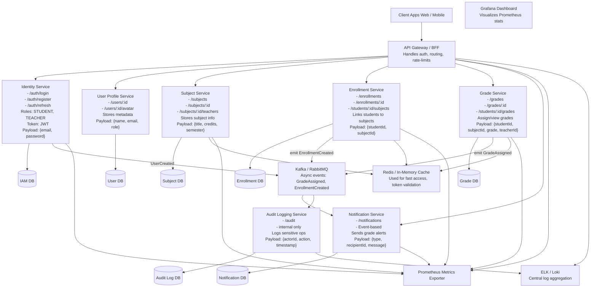
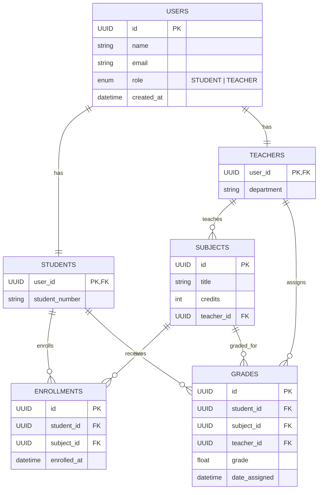

# Gradebook

### Scheme

### erDiagram

# Gradebook Microservices System - Requirements

This document outlines the functional requirements for the Gradebook microservices system, expressed as user stories. These user stories capture the system's features from the perspective of different users (Students, Teachers, and Administrators).

## Table of Contents
1.  [User Roles](#1-user-roles)
2.  [User Management](#2-user-management)
3.  [Subject Management](#3-subject-management)
4.  [Enrollment Management](#4-enrollment-management)
5.  [Grade Management](#5-grade-management)
6.  [Notifications](#6-notifications)
7.  [Audit Logging](#7-audit-logging)

---

## 1. User Roles

*   **STUDENT:** A user who enrolls in subjects and receives grades.
*   **TEACHER:** A user who teaches subjects, manages enrollments, and assigns/manages grades.
*   **ADMINISTRATOR:** An internal user responsible for system oversight, user management, and audit log review (implicit from Audit Service).

## 2. User Management

### 2.1. User Registration & Authentication

*   **As a new user,** I want to be able to register with my email and a secure password, so that I can access the Gradebook system.
*   **As a registered user,** I want to be able to log in with my credentials, so that I can access my personalized Gradebook features.
*   **As an authenticated user,** I want my session to remain active for a reasonable period, and to be able to refresh my authentication token, so that I don't have to log in repeatedly.
*   **As an administrator,** I want to be able to assign or modify user roles (STUDENT, TEACHER) so that users have appropriate permissions.

### 2.2. User Profile Management

*   **As an authenticated user,** I want to view my profile details (name, email, role), so that I can confirm my information.
*   **As an authenticated user,** I want to be able to update my name and other non-sensitive profile information, so that my details are current.
*   **As an authenticated user,** I want to be able to upload and change my profile avatar, so that I can personalize my account.

## 3. Subject Management

*   **As a teacher,** I want to be able to create new subjects, specifying their title, credits, and semester, so that I can organize my courses.
*   **As a teacher,** I want to be able to view and manage the list of subjects I teach, so that I can keep track of my courses.
*   **As a teacher,** I want to be able to update the details of a subject I teach, so that I can correct or modify course information.
*   **As a student,** I want to be able to browse all available subjects, so that I can choose courses to enroll in.
*   **As a student,** I want to be able to view the details of a specific subject, so that I can understand its content and requirements.
*   **As a teacher,** I want to be able to assign other teachers to a subject, so that multiple instructors can manage a single course.

## 4. Enrollment Management

*   **As a student,** I want to be able to enroll myself in an available subject, so that I can officially join a course.
*   **As a student,** I want to be able to view all the subjects I am currently enrolled in, so that I can keep track of my academic commitments.
*   **As a student,** I want to be able to un-enroll from a subject, so that I can drop a course if needed.
*   **As a teacher,** I want to be able to view a list of all students enrolled in a subject I teach, so that I can manage my class roster.

## 5. Grade Management

*   **As a teacher,** I want to be able to assign a grade to a specific student for a specific subject I teach, so that I can record their academic performance.
*   **As a teacher,** I want to be able to update an existing grade for a student in a subject I teach, so that I can correct errors or reflect new assessments.
*   **As a teacher,** I want to be able to view all the grades for students in the subjects I teach, so that I have a comprehensive overview of their progress.
*   **As a student,** I want to be able to view all my assigned grades across all the subjects I am enrolled in, so that I can monitor my academic standing.
*   **As a teacher,** I want to be able to delete a grade for a student in a subject I teach, so that I can remove incorrect or irrelevant entries.

## 6. Notifications

*   **As a student,** I want to receive an automatic notification when a new grade is assigned or an existing grade is updated for me, so that I am immediately aware of changes to my academic record.
*   **As a student,** I want to receive an automatic notification upon successfully enrolling in a subject, so that I have confirmation of my registration.
*   **As a user,** I want to be able to view a history of all notifications sent to me, so that I can review past alerts.

## 7. Audit Logging

*   **As an administrator,** I want all sensitive actions (e.g., grade changes, user registrations, subject modifications) to be logged automatically, including who performed the action and when, so that I can ensure system integrity and accountability.
*   **As an administrator,** I want to be able to access and review these audit logs, so that I can investigate activities within the system.

---

# Gradebook System — REST API Endpoints

---

## Identity Service

| Method | Endpoint         | Description                      | Payload                   | Roles |
|--------|------------------|----------------------------------|---------------------------|-------|
| POST   | /auth/register   | Register a new user              | { email, password }       | —     |
| POST   | /auth/login      | Log in a user                    | { email, password }       | —     |
| POST   | /auth/refresh    | Refresh JWT token                | —                         | —     |

---

## User Profile Service

| Method | Endpoint               | Description                        | Payload                  | Roles |
|--------|------------------------|------------------------------------|--------------------------|-------|
| GET    | /users/:id             | Get user profile                   | —                        | ALL   |
| PUT    | /users/:id             | Update user profile                | { name, email, role }    | ALL   |
| PUT    | /users/:id/avatar      | Upload avatar                      | file (multipart/form)    | ALL   |

---

## Subject Service

| Method | Endpoint                   | Description                                 | Payload                         | Roles    |
|--------|----------------------------|---------------------------------------------|----------------------------------|----------|
| GET    | /subjects                  | Get all subjects                            | —                                | ALL      |
| POST   | /subjects                  | Create a new subject                        | { title, credits, semester }     | TEACHER  |
| GET    | /subjects/:id             | Get subject details                         | —                                | ALL      |
| PUT    | /subjects/:id             | Update subject                              | { title, credits, semester }     | TEACHER  |
| GET    | /subjects/:id/teachers    | Get subject's teachers                      | —                                | ALL      |
| POST   | /subjects/:id/teachers    | Add teacher to subject                      | { teacherId }                    | TEACHER  |

---

## Enrollment Service

| Method | Endpoint                        | Description                                      | Payload                    | Roles    |
|--------|----------------------------------|--------------------------------------------------|-----------------------------|-----------|
| POST   | /enrollments                     | Enroll in a subject                              | { studentId, subjectId }    | STUDENT   |
| GET    | /enrollments/:id                | Get enrollment information                       | —                           | STUDENT   |
| DELETE | /enrollments/:id                | Unenroll from a subject                          | —                           | STUDENT   |
| GET    | /students/:id/subjects          | Get student’s subjects                           | —                           | STUDENT   |
| GET    | /subjects/:id/students          | Get students in a subject                        | —                           | TEACHER   |

---

## Grade Service

| Method | Endpoint                        | Description                                         | Payload                                      | Roles            |
|--------|----------------------------------|-----------------------------------------------------|-----------------------------------------------|------------------|
| POST   | /grades                          | Assign a grade                                      | { studentId, subjectId, grade, teacherId }     | TEACHER          |
| PUT    | /grades/:id                      | Update a grade                                      | { grade }                                     | TEACHER          |
| DELETE | /grades/:id                      | Delete a grade                                      | —                                             | TEACHER          |
| GET    | /grades/:id                      | Get grade details                                   | —                                             | STUDENT/TEACHER  |
| GET    | /students/:id/grades             | View all student’s grades                           | —                                             | STUDENT/TEACHER  |

---

## Notification Service

| Method | Endpoint         | Description                            | Payload                             | Roles |
|--------|------------------|----------------------------------------|--------------------------------------|-------|
| GET    | /notifications   | Get all user notifications             | —                                    | ALL   |

*Automatic Events:*  
- `EnrollmentCreated` → sends notification for successful enrollment  
- `GradeAssigned/Updated` → sends notification for grade change

---

## Audit Logging Service (Internal)

| Method | Endpoint     | Description                        | Payload                              | Access |
|--------|--------------|------------------------------------|---------------------------------------|--------|
| GET    | /audit       | View change logs                   | —                                     | ADMIN  |

*Automatic Events:*  
- User registration  
- Grade assignment/update  
- Subject updates

---

## Other

- All requests require JWT authentication (except `/auth/*`)
- Supported roles: STUDENT, TEACHER, ADMINISTRATOR
- Metrics are available via Prometheus
- Logs are centrally stored in the ELK stack
